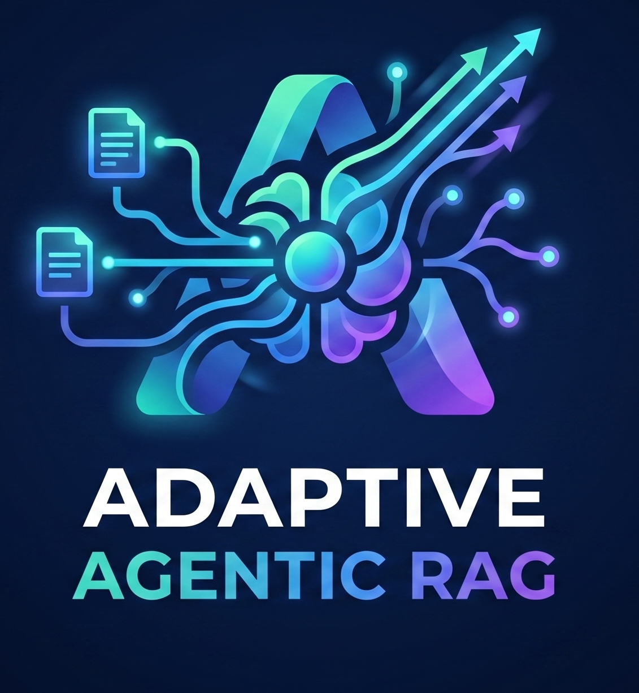
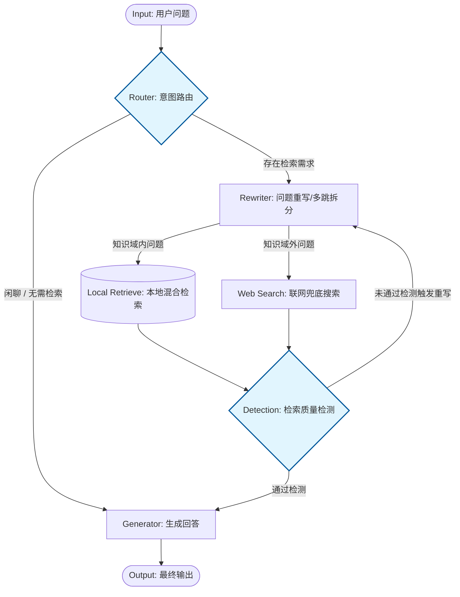
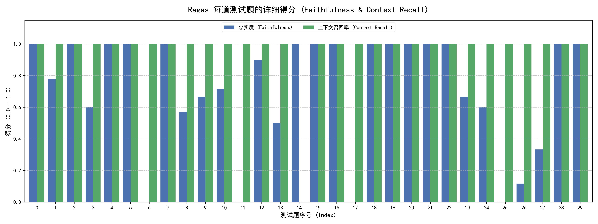

<div align="right">
  <a href="README_EN.md">English</a> / 中文
</div>

# Adaptive Agentic RAG

---

<div align="center">

  <div style="margin: 20px 0;">
    
  </div>

  **基于 LangGraph 与混合检索的自适应智能 RAG 系统**

  <div style="width: 100%; height: 2px; margin: 20px 0; background: linear-gradient(90deg, transparent, #007DFF, transparent);"></div>

  <p align="center">
    <a href="https://www.python.org/" target="_blank">
        
    </a>
    <a href="https://fastapi.tiangolo.com/" target="_blank">
        
    </a>
    <a href="https://python.langchain.com/" target="_blank">
        
    </a>
    <a href="https://python.langchain.com/docs/langgraph/" target="_blank">
        
    </a>
    <a href="https://milvus.io/" target="_blank">
        
    </a>
    <a href="https://www.mongodb.com/" target="_blank">
        
    </a>
    <a href="https://redis.io/" target="_blank">
        
    </a>
    <a href="https://docs.ragas.io/en/latest/" target="_blank">
        
    </a>
  </p>

</div> 
<br> > 本项目通过动态意图路由、代词消解及多跳问题拆分，实现了针对垂直领域（如心理学）的精准知识检索与抗幻觉回答。


## 🏗️ 核心架构



## ✨ 主要功能

- **📥 文档导入即用**：上传 DOCX / Markdown 文档，自动完成智能分块、向量化与双写入库（Milvus + MongoDB），即可构建稳定的垂直领域 RAG 对话。
- **🔀 智能意图路由**：自动区分闲聊与知识密集型问题，匹配知识域标签，动态决定走本地检索、联网搜索还是直接生成。
- **🔄 查询自优化**：支持代词指代消解、多跳问题拆分、领域降噪，复杂查询自动拆解为多个子查询并发检索。
- **🛡️ 质量闭环**：Reranker 重排序 + LLM Grader 二次评估，检索质量不达标自动打回重写重试，上限保护防止死循环。
- **🌐 联网兜底**：本地知识库无法覆盖时，通过 MCP 协议接入 Bing 搜索，自动补全外部事实。
- **📊 评估可观测**：集成 Ragas 评估框架，支持 Faithfulness / ContextRecall 指标，一键生成可视化报告。

## 🚀 一键启动

### Docker Compose（推荐）

```bash
# 0. 提前在宿主机启动 MCP 搜索服务（另一个终端）
npx -y bing-cn-mcp

# 1. 编辑 .env.docker，填入 API Key
# 2. 一键启动 Milvus + MongoDB + RAG API
docker compose up -d

# 3. 验证
curl http://localhost:8000/health
```

> ⚠️ MCP 服务 `bing-cn-mcp` 需在宿主机单独启动，不在 Docker Compose 编排范围内。

启动后访问 Swagger 文档：http://localhost:8000/docs

### 本地运行

```bash
pip install -r requirements.txt
# 确保 Milvus、MongoDB、Embedding 服务已运行
uvicorn src.api.main:app --host 0.0.0.0 --port 8000 --reload
```

---

## 🛠️ 核心技术细节

### 1. 混合检索与大文档持久化

采用 **"小块检索，大块生成"** 的分离存储架构：

- **Milvus（向量检索区）**：存储 250-token 子块的 Dense + Sparse 双向量（BGE-M3 编码，1024 维），通过 WeightedRanker (0.7/0.3) 加权融合召回，保证精度。
- **MongoDB（文档存储区）**：存储 1000-token 父块完整上下文。Milvus 命中后根据 `parent_id` 回源拉取大块，避免上下文截断。当 Router 判定需要宏观总结时，自动触发大块替换。

### 2. 基于 LangGraph 的状态机自纠错

系统基于 LangGraph StateGraph 构建，非固定 Pipeline，而是条件边驱动的图状态机：

- **Reranker + Grader 闭环重试**：检索结果先经 `gte-rerank-v2` 重排序并过滤低分文档（< 0.05），再由 LLM Grader 评估是否包含回答所需事实。不合格则携带反馈打回 Rewriter 反思重写，最多重试 3 次。
- **多跳拆分**：Rewriter 将复杂问题拆解为多个独立子查询，并行检索后合并去重，提升复杂逻辑下的召回率。
- **Checkpoint 三级降级**：会话持久化依次尝试 MongoDB → Redis → MemorySaver，兼顾生产可靠性与本地调试便利性。

### 3. 抗幻觉与兜底机制

- **动态边界识别**：Router 预先判定提问是否超出预设知识域，域内走本地检索，域外直接走联网搜索，闲聊跳过检索。
- **联网兜底**：当本地知识库无法覆盖时，通过 MCP 协议连接本地部署的 `bing-cn-mcp`（`npx -y bing-cn-mcp` 启动，需提前在宿主机运行），`asyncio.gather` 并发搜索所有子查询，自动添加领域前缀提升相关性。
- **精准拒答**：多次检索 + 联网均失败时，标记 `potential_hallucination`，告知用户无法回答而非强行编造。

### 4. 领域模态下推

入库时通过 `inject_knowledge_domains_batch()` 为文档注入领域标签，检索时 Router 匹配到的 `matched_domain` 会转化为 Milvus 过滤表达式，在同一 Collection 内精准限定搜索范围，避免跨领域噪音。
同时网络搜索时，会自动添加领域前缀，提升相关性，提升搜索准确率。

## 📡 API 接口

> 完整 Swagger 文档：http://localhost:8000/docs

### 文档导入

| 方法   | 路径           | 说明                                   |
| ------ | -------------- | -------------------------------------- |
| `POST` | `/ingest/docx` | 上传 DOCX 文件，自动分块、向量化、入库 |

**请求体：**

```json
{
  "file_path": "D:/docs/心理学.docx",
  "user_id": "user_001",
  "session_id": "session_001",
  "domains": ["心理学"]
}
```

**响应：**

```json
{
  "status": "ok",
  "file_path": "D:/docs/心理学.docx",
  "total_docs_loaded": 5,
  "total_chunks": 128,
  "vector_inserts": 128,
  "kv_inserts": 128
}
```

### 知识问答

| 方法   | 路径    | 说明                    |
| ------ | ------- | ----------------------- |
| `POST` | `/chat` | 发送问题，获取 RAG 回答 |

**请求体：**

```json
{
  "question": "什么是社会惰化效应？",
  "user_id": "user_001",
  "session_id": "session_001"
}
```

**响应：**

```json
{
  "answer": "社会惰化效应是指...",
  "retrieval_grade": "yes",
  "documents": [{"content": "...", "metadata": {...}}]
}
```

### 数据管理

| 方法     | 路径                   | 说明                        |
| -------- | ---------------------- | --------------------------- |
| `GET`    | `/milvus/query`        | 直接查询 Milvus 向量库      |
| `GET`    | `/milvus/count`        | 查看 Milvus 集合统计        |
| `DELETE` | `/milvus/collection`   | 删除 Milvus 集合            |
| `GET`    | `/mongo/get/{node_id}` | 根据 node_id 读取原始文档块 |
| `GET`    | `/mongo/list`          | 列出当前所有文档块 ID       |
| `DELETE` | `/mongo/key/{key}`     | 删除指定 MongoDB 记录       |

### 健康检查

| 方法  | 路径      | 说明             |
| ----- | --------- | ---------------- |
| `GET` | `/health` | 服务健康状态检查 |

---

## 📁 项目结构

```
adaptive_agentic_rag/
├── src/
│   ├── api/                        # FastAPI 路由层
│   │   ├── main.py                 # 应用入口、lifespan 管理、中间件、全局异常
│   │   └── routers/
│   │       ├── chat.py             # /chat 问答接口
│   │       ├── ingest.py           # /ingest 文档导入接口
│   │       └── query.py            # /milvus/* /mongo/* 数据管理接口
│   │
│   ├── agent/                      # LangGraph Agent 核心
│   │   ├── graph.py                # StateGraph 构建、边路由、节点注册
│   │   ├── state.py                # GraphState 状态定义
│   │   └── node/
│   │       ├── router.py           # 意图路由节点（闲聊 vs 检索）
│   │       ├── rewriter_node.py    # 查询重写节点（代词消解、多跳拆分）
│   │       ├── retrieve.py         # 混合检索节点（Dense + Sparse 并发）
│   │       ├── grader_node.py      # LLM Grader 质量评估节点
│   │       ├── generate_node.py    # 生成回答节点
│   │       └── web_search_node.py  # MCP 联网兜底节点
│   │
│   ├── core/                       # 底层客户端封装
│   │   ├── config.py               # 配置管理（Pydantic Settings）
│   │   ├── llm_manager.py           # LLM 调用管理（支持多模型）
│   │   ├── embedding_client.py      # Embedding 客户端
│   │   ├── vector_client.py         # Milvus 向量库客户端
│   │   ├── reranker_client.py       # Reranker 重排客户端
│   │   └── db_client.py             # MongoDB 客户端
│   │
│   ├── retrieval/                  # 检索策略
│   │   └── hybrid.py               # 混合检索（Dense + Sparse WeightedRanker）
│   │
│   ├── data/                       # 数据处理管道
│   │   ├── loader/
│   │   │   ├── base.py             # 文档加载器基类
│   │   │   ├── docx_loader.py      # DOCX 加载器
│   │   │   └── factory.py          # 元数据注入工厂（标签/用户/领域）
│   │   ├── splitter/
│   │   │   ├── pipeline.py         # 分块流水线编排
│   │   │   └── steps/
│   │   │       ├── prose.py        # 散文/论文类长文本递归分块
│   │   │       └── markup.py       # 标记文档（Markdown）分块
│   │   └── indexer.py              # 双写索引（Milvus + MongoDB）
│   │
│   ├── tests/
│   │   ├── ragas_eval.py          # Ragas 评估脚本
│   │   └── test.py                # 单元测试
│   │
│   └── sources/                   # 静态资源
│       ├── ragas_scores_chart.png  # 评估结果图表
│       └── 9qc6xt9qc6xt9qc6.png    # Logo
│
├── docker-compose.yml              # 容器编排（Milvus + MongoDB + RAG API）
├── Dockerfile                      # RAG API 镜像构建
├── requirements.txt               # Python 依赖
├── .env.docker                    # Docker 环境变量模板
├── .gitignore                     # Git 忽略配置
└── .dockerignore                  # Docker 构建忽略配置
```

---

## 📊 评估结果

基于 Ragas 框架对系统进行 Faithfulness（忠实度）与 Context Recall（上下文召回率）评估：



> **📝 评测诊断：检索基建符合预期，生成节点需进一步约束**
>
> 基于 Ragas 框架对当前 Agentic RAG 系统进行的 30 组高难度自动化评测（涵盖单跳、多跳及指代消解问题），核心表现如下：
>
> - 🟢 **检索侧 (Context Recall) 接近满分**：绿色柱状图显示，底层基于 `Milvus` + `BGE Rerank` 的向量检索与重排架构非常扎实。系统能够精准、完整地召回绝大部分标准答案所需的文档片段。
> - 🔵 **生成侧 (Faithfulness) 均分约 80%**：蓝色柱状图显示，大模型在忠实度上存在一定波动。经分析，失分并非由于未找到答案，而是因为 LLM 在生成环节过于"热心"，主动引入了文档外的先验知识（如自行补充举例），触发了 Ragas 的幻觉惩罚机制。
>
> **🚀 优化计划 (Next Steps)**
> 下一步的核心工作将聚焦于 `Generate Node` 的 Prompt 锁死工程：严格限制大模型"仅基于给定上下文作答，严禁发散与自我发挥"，预计可将 Faithfulness 指标平滑拉升至 90% 以上。
