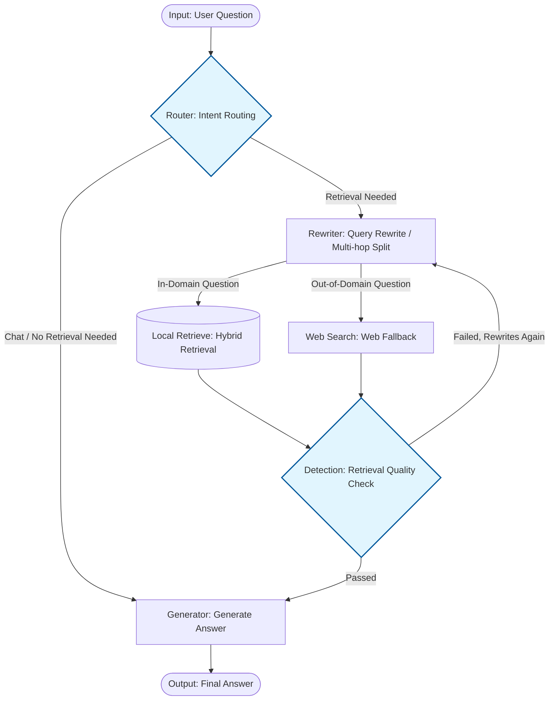

<div align="right">
  <a href="README.md">中文</a> / English
</div>

# Adaptive Agentic RAG

---

<div align="center">

  <div style="margin: 20px 0;">
    
  </div>

**Adaptive Intelligent RAG System Based on LangGraph and Hybrid Retrieval**

  <div style="width: 100%; height: 2px; margin: 20px 0; background: linear-gradient(90deg, transparent, #007DFF, transparent);"></div>

  <div style="display: flex; justify-content: center; align-items: center;">
    <div style="margin: 0 10px;">
    <p align="center">
    <a href="https://www.python.org/" target="_blank">
        
    </a>
    <a href="https://fastapi.tiangolo.com/" target="_blank">
        
    </a>
    <a href="https://python.langchain.com/" target="_blank">
        
    </a>
    <a href="https://python.langchain.com/docs/langgraph/" target="_blank">
        
    </a>
    <a href="https://milvus.io/" target="_blank">
        
    </a>
    <a href="https://www.mongodb.com/" target="_blank">
        
    </a>
    <a href="https://redis.io/" target="_blank">
        
    </a>
    <a href="https://docs.ragas.io/en/latest/" target="_blank">
        
    </a>
</p>
  </div>
</div>
</div>

> This project implements precise knowledge retrieval and hallucination-resistant answers for vertical domains (e.g., Psychology) through dynamic intent routing, pronoun resolution, and multi-hop question decomposition.

## 🏗️ Core Architecture



## ✨ Key Features

- **📥 Upload & Go**: Upload DOCX / Markdown documents, automatically smart-chunk, vectorize, and dual-write to Milvus + MongoDB — instantly build a domain-specific RAG chatbot.
- **🔀 Intelligent Intent Routing**: Automatically distinguishes chitchat from knowledge-intensive queries, matches domain tags, dynamically decides between local retrieval, web search, or direct generation.
- **🔄 Self-Optimizing Queries**: Supports pronoun coreference resolution, multi-hop question decomposition, and domain noise reduction — complex queries are automatically split into parallel sub-queries.
- **🛡️ Quality Loop**: Reranker re-ranking + LLM Grader secondary evaluation; substandard retrieval triggers rewrite-and-retry with loop protection.
- **🌐 Web Fallback**: When local knowledge base can't cover the query, MCP protocol connects to Bing search via local `bing-cn-mcp`, automatically supplements external facts.
- **📊 Observable Evaluation**: Integrated Ragas evaluation framework with Faithfulness / Context Recall metrics and one-click visualization report generation.

## 🚀 One-Click Startup

### Docker Compose (Recommended)

```bash
# 0. Start MCP search service on host (in another terminal)
npx -y bing-cn-mcp

# 1. Fill in API keys in .env.docker
# 2. One-click start Milvus + MongoDB + RAG API
docker compose up -d

# 3. Verify
curl http://localhost:8000/health
```

> ⚠️ MCP service `bing-cn-mcp` must be started separately on the host and is not managed by Docker Compose.

After startup, access Swagger docs：http://localhost:8000/docs

### Local Run

```bash
pip install -r requirements.txt
# Ensure Milvus, MongoDB, Embedding services are running
uvicorn src.api.main:app --host 0.0.0.0 --port 8000 --reload
```

---

## 🛠️ Core Technical Details

### 1. Hybrid Retrieval & Large Document Persistence

Adopts a **"small chunk for retrieval, large chunk for generation"** separation architecture:

- **Milvus (Vector Retrieval Zone)**: Stores Dense + Sparse bi-vectors (BGE-M3 encoding, 1024-dim) for 250-token sub-chunks, fused via WeightedRanker (0.7/0.3) for precision.
- **MongoDB (Document Storage Zone)**: Stores 1000-token parent chunk full context. When Milvus hits, `parent_id` pulls the large chunk to avoid context truncation. When Router determines macro summarization is needed, large chunk replacement is automatically triggered.

### 2. LangGraph State Machine Self-Correction

Built on LangGraph StateGraph — not a fixed pipeline, but a conditional edge-driven state machine:

- **Reranker + Grader Closed-Loop Retry**: Retrieval results are first re-ranked by `gte-rerank-v2` and low-scored documents (< 0.05) are filtered, then LLM Grader evaluates whether facts needed for the answer are present. Failures carry feedback back to Rewriter for reflection and rewrite, up to 3 retries max.
- **Multi-hop Split**: Rewriter decomposes complex questions into independent sub-queries, parallel retrieval then merge-deduplication, improving recall for complex logic.
- **Three-Level Checkpoint Fallback**: Session persistence tries MongoDB → Redis → MemorySaver in order, balancing production reliability and local debugging convenience.

### 3. Hallucination Resistance & Fallback

- **Dynamic Boundary Detection**: Router pre-judges whether the query exceeds the preset knowledge domain — in-domain uses local retrieval, out-of-domain goes directly to web search, chitchat skips retrieval entirely.
- **Web Fallback**: When local knowledge base can't cover, MCP protocol connects to locally deployed `bing-cn-mcp` (`npx -y bing-cn-mcp`, must run on host first), `asyncio.gather` concurrently searches all sub-queries, auto-adds domain prefix to boost relevance.
- **Precise Refusal**: When multiple retrievals + web search all fail, marks `potential_hallucination` and tells the user it cannot answer rather than fabricating.

### 4. Domain Modality Push-Down

At ingestion, `inject_knowledge_domains_batch()` injects domain tags into documents. At retrieval, Router's `matched_domain` is converted into a Milvus filter expression, precisely scoping the search within the same Collection and avoiding cross-domain noise. Meanwhile, web search automatically adds domain prefixes to boost relevance and search accuracy.

## 📡 API Reference

> Full Swagger docs：http://localhost:8000/docs

### Document Ingestion

| Method | Path           | Description                                   |
| ------ | -------------- | --------------------------------------------- |
| `POST` | `/ingest/docx` | Upload DOCX, auto-chunk, vectorize, and index |

**Request Body：**

```json
{
  "file_path": "D:/docs/psychology.docx",
  "user_id": "user_001",
  "session_id": "session_001",
  "domains": ["psychology"]
}
```

**Response：**

```json
{
  "status": "ok",
  "file_path": "D:/docs/psychology.docx",
  "total_docs_loaded": 5,
  "total_chunks": 128,
  "vector_inserts": 128,
  "kv_inserts": 128
}
```

### Knowledge QA

| Method | Path    | Description                       |
| ------ | ------- | --------------------------------- |
| `POST` | `/chat` | Send a question, get a RAG answer |

**Request Body：**

```json
{
  "question": "What is social loafing?",
  "user_id": "user_001",
  "session_id": "session_001"
}
```

**Response：**

```json
{
  "answer": "Social loafing is the phenomenon...",
  "retrieval_grade": "yes",
  "documents": [{"content": "...", "metadata": {...}}]
}
```

### Data Management

| Method   | Path                   | Description                             |
| -------- | ---------------------- | --------------------------------------- |
| `GET`    | `/milvus/query`        | Directly query Milvus vector database   |
| `GET`    | `/milvus/count`        | Get Milvus collection statistics        |
| `DELETE` | `/milvus/collection`   | Delete Milvus collection                |
| `GET`    | `/mongo/get/{node_id}` | Read original document chunk by node_id |
| `GET`    | `/mongo/list`          | List all document chunk IDs             |
| `DELETE` | `/mongo/key/{key}`     | Delete specified MongoDB record         |

### Health Check

| Method | Path      | Description          |
| ------ | --------- | -------------------- |
| `GET`  | `/health` | Service health check |

---

## 📁 Project Structure

```
adaptive_agentic_rag/
├── src/
│   ├── api/                        # FastAPI Route Layer
│   │   ├── main.py                 # App entry, lifespan, middleware, global exception
│   │   └── routers/
│   │       ├── chat.py             # /chat QA endpoint
│   │       ├── ingest.py           # /ingest document ingestion endpoint
│   │       └── query.py            # /milvus/* /mongo/* data management endpoints
│   │
│   ├── agent/                      # LangGraph Agent Core
│   │   ├── graph.py                # StateGraph construction, edge routing, node registration
│   │   ├── state.py                # GraphState definition
│   │   └── node/
│   │       ├── router.py           # Intent routing node (chat vs retrieval)
│   │       ├── rewriter_node.py    # Query rewrite node (coreference, multi-hop)
│   │       ├── retrieve.py         # Hybrid retrieval node (Dense + Sparse concurrency)
│   │       ├── grader_node.py      # LLM Grader quality evaluation node
│   │       ├── generate_node.py    # Generate answer node
│   │       └── web_search_node.py  # MCP web fallback node
│   │
│   ├── core/                       # Low-level Client Wrappers
│   │   ├── config.py               # Config management (Pydantic Settings)
│   │   ├── llm_manager.py          # LLM call management (multi-model support)
│   │   ├── embedding_client.py     # Embedding client
│   │   ├── vector_client.py        # Milvus vector database client
│   │   ├── reranker_client.py      # Reranker re-rank client
│   │   └── db_client.py            # MongoDB client
│   │
│   ├── retrieval/                  # Retrieval Strategy
│   │   └── hybrid.py               # Hybrid retrieval (Dense + Sparse WeightedRanker)
│   │
│   ├── data/                       # Data Processing Pipeline
│   │   ├── loader/
│   │   │   ├── base.py             # Document loader base class
│   │   │   ├── docx_loader.py      # DOCX loader
│   │   │   └── factory.py          # Metadata injection factory (tags/user/domain)
│   │   ├── splitter/
│   │   │   ├── pipeline.py         # Chunking pipeline orchestration
│   │   │   └── steps/
│   │   │       ├── prose.py        # Prose/paper long-text recursive chunking
│   │   │       └── markup.py       # Markup document (Markdown) chunking
│   │   └── indexer.py              # Dual-write indexer (Milvus + MongoDB)
│   │
│   ├── tests/
│   │   ├── ragas_eval.py           # Ragas evaluation script
│   │   └── test.py                 # Unit tests
│   │
│   └── sources/                    # Static Resources
│       ├── ragas_scores_chart.png  # Evaluation result chart
│       └── 9qc6xt9qc6xt9qc6.png    # Logo
│
├── docker-compose.yml              # Container orchestration (Milvus + MongoDB + RAG API)
├── Dockerfile                     # RAG API image build
├── requirements.txt               # Python dependencies
├── .env.docker                    # Docker environment variable template
├── .gitignore                     # Git ignore config
└── .dockerignore                  # Docker build ignore config
```

---

## 📊 Evaluation Results

Evaluated on Faithfulness and Context Recall using the Ragas framework:


> **📝 Evaluation Diagnosis: Retrieval Infrastructure Meets Expectations, Generation Node Needs Further Constraint**
>
> Based on 30 sets of high-difficulty automated evaluations covering single-hop, multi-hop, and coreference resolution questions, core performance is as follows:
>
> - 🟢 **Retrieval Side (Context Recall) Near Perfect**: The green bars show that the underlying Milvus + BGE Rerank vector retrieval and re-ranking architecture is very solid. The system can precisely and completely retrieve the vast majority of document snippets required for standard answers.
> - 🔵 **Generation Side (Faithfulness) ~80% Average**: The blue bars show some fluctuation in LLM faithfulness. Analysis reveals that point deductions were not due to failing to find answers, but because the LLM was too "enthusiastic" in the generation phase, proactively introducing prior knowledge outside the documents (e.g., adding examples on its own), triggering Ragas's hallucination penalty.
>
> **🚀 Optimization Plan (Next Steps)**
> The next core work will focus on `Generate Node` Prompt Lockdown Engineering: strictly restricting the LLM to "answer only based on given context, strictly prohibit divergence and self-improvisation" — expected to smoothly pull Faithfulness above 90%.
